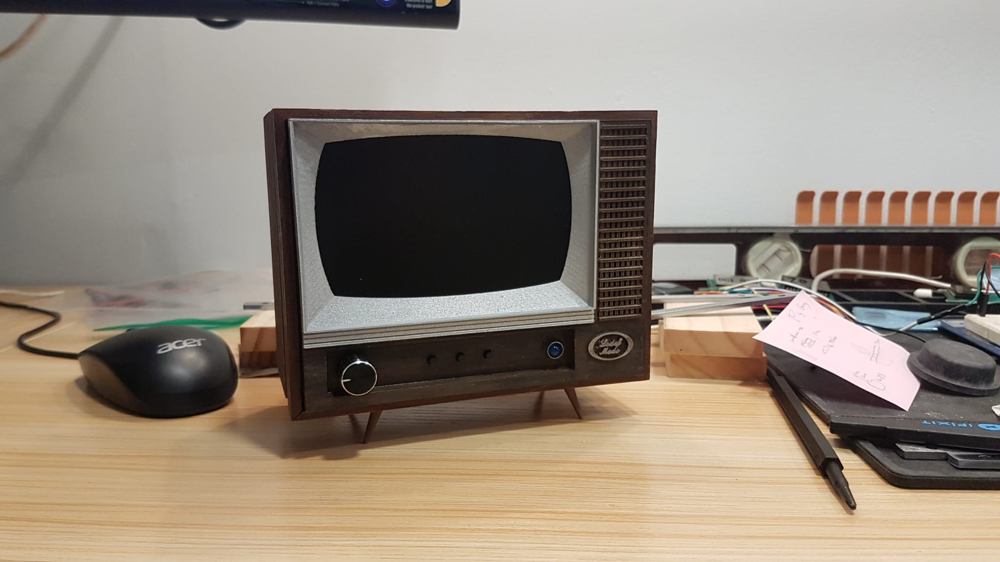
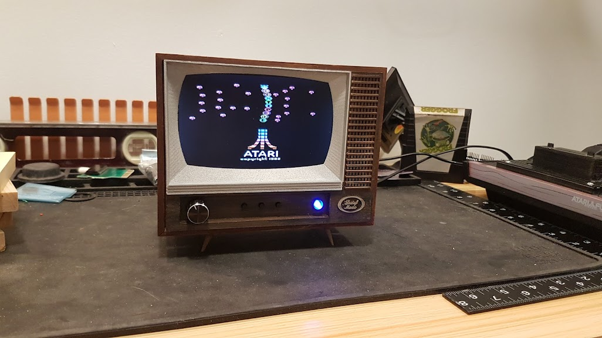
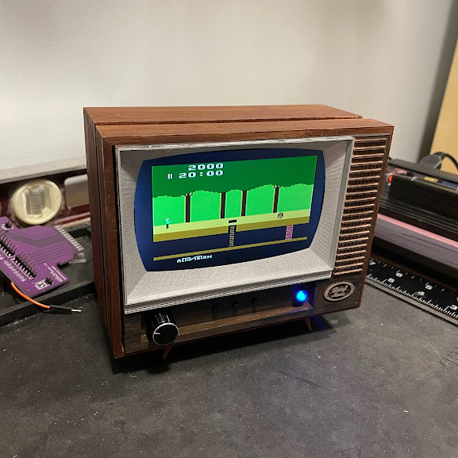
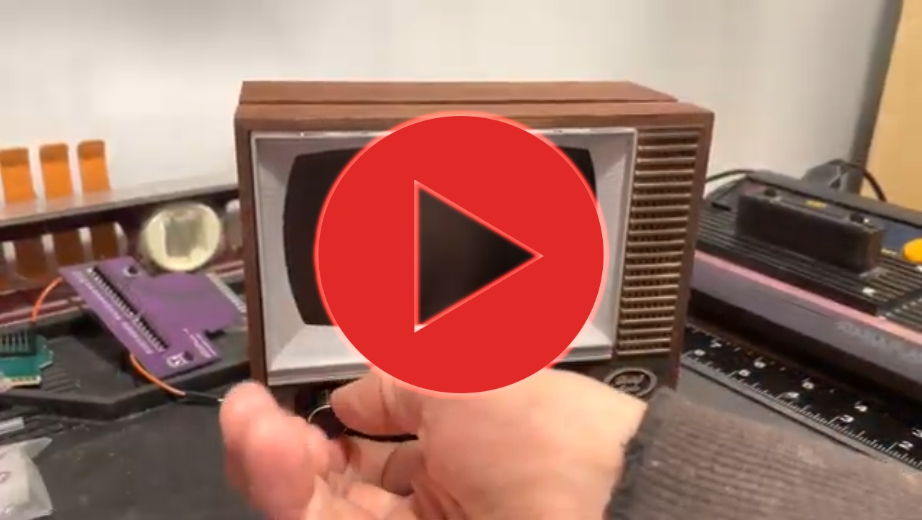
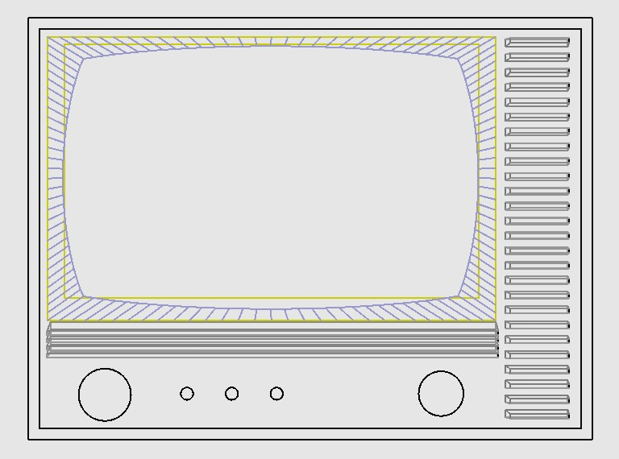
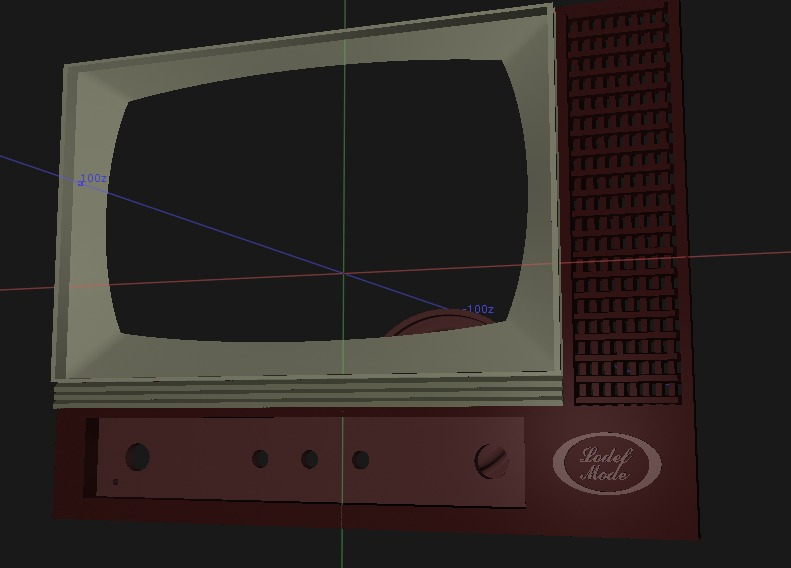
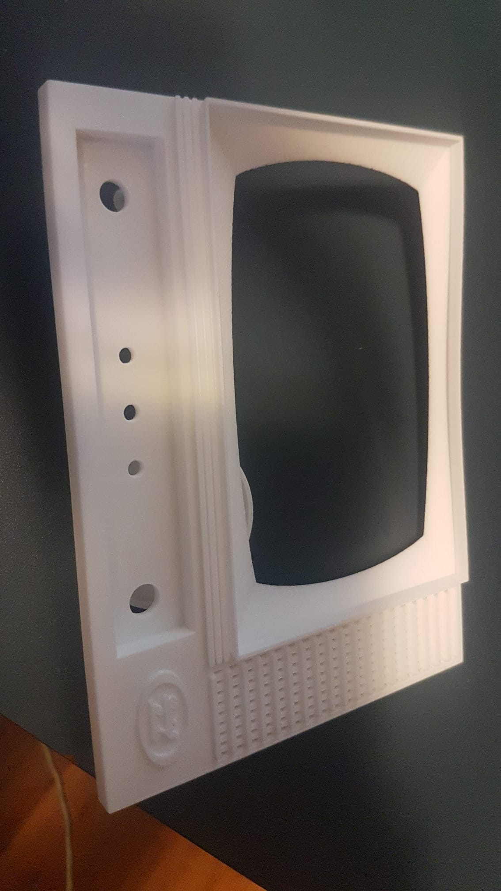
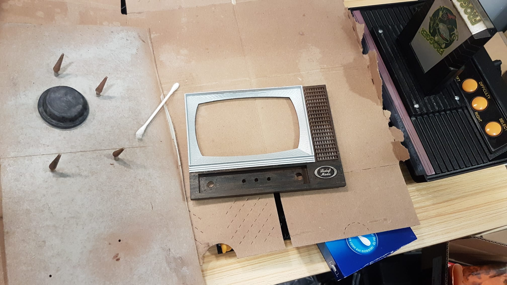
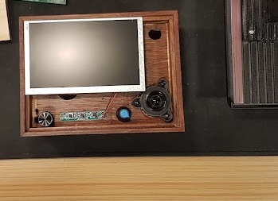

# minitv

Miniature Retro-style television made from stock components and 3D printed face.
- Accepts A/V input.
- Audio is separately amplified.
- All buttons functional: (Power/Volume, OSD menu buttons, pilot light)

Parts: (All prices CAD)

### Structure

- 3D Printed Face: $75.28 ( + $16.62 S/H) 
mini_out112_jan3_2022.wrl 
shapeways.com: White Processed Versatile Plastic

Adjustment Notes for next revision:

	- Volume pot hole slightly too small.
	- Volume pot guide hole should be facing outward in line with buttons, and bit bigger, half way through.
	- Power led hole slightly too small.
	- Be sure not to drill leg holes too large.
	- Legs themselves could be larger.
	- Bezel was a tad short / screen edges poke through.
	- Add back support for OSD buttons.
	- Maybe a back support for screen to avoid gluing.

- Wooden Box: $24.99 
Bamboo wood box, bamboo wood storage box with rolling cover, wooden storage box combination (6.3X4.72X2.76 inch) 
https://www.amazon.ca/gp/product/B084VH5GCK

### Electronics

- Car Monitor LCD: $31.99 
Yasoca 5 Inch TFT LCD Car Color Rear View Monitor Screen for Parking Rear View Backup Camera with 2 Optional Bracket 
https://www.amazon.ca/gp/product/B089YS692G

- Audio Amplifier: $9.79 
DC1.8-12V TDA2822M Mini Audio Amplifier Board 2.0 Dual Channel 3.5mm AUX Stereo Audio Amp Module with Knob 
https://www.amazon.ca/gp/product/B07F8K374S

- Speakers: $9.26 (1 of 2 used) 
Gikfun Round Micro Speaker Diameter 30mm 8Ohm 8R 2W for Arduino Mini Box Speakers DIY (Pack of 2pcs) EK1887C 
https://www.amazon.ca/gp/product/B07BFTYY6L

- Rotary Power/Volume Switch: $11.49 
uxcellStereo B503 50K Ohm Dual Linear Taper Volume Control Potentiometer Switch 
https://www.amazon.ca/gp/product/B00JR5B7MO

- Metal pilot LED: $12.99  (1 of 4 used) 
8mm LED Pilot Light, 4 Pcs 12V Universal Dash Indicator Light LED Panel Indicator Lights LED Dash Bulbs Lamp for Cars Van Trucks Boats(Blue) 
https://www.amazon.ca/gp/product/B07V7WRPGT

### Connectors

- Power connector: $6.80 
Power Barrel Connector Jack 2.10mm ID (0.083"), 5.50mm OD (0.217") Panel Mount 
Tensility International Corp 54-00151 (Digikey:	839-1580-ND)

- Yellow RCA connector: $2.78 
3.20mm ID, 9.00mm OD (RCA) Phono (RCA) Jack Mono Connector Solder Eyelet(s) 
Switchcraft Inc. BPJF04X (Digikey: SC2442-ND)

- White RCA connector: $2.68 
3.20mm ID, 9.00mm OD (RCA) Phono (RCA) Jack Mono Connector Solder Eyelet(s) 
Switchcraft Inc.  BPJF03X (Digikey: SC2441-ND)

- Metal Knob: $10.01 (1 of 5 used) 
uxcell5 Pcs Black Metal 6mm Knurled Shaft Insert Dia. Potentiometer Control Knobs 
https://www.amazon.ca/gp/product/B00CQLOSTK

- Headphone Jack 
3.5mm Mini Plug

### Paints + Adhesives

- Rust-Oleum Painter's Touch 2X Paint And Primer / Metallic Aluminum
- BEHR Interior/Exterior Aerosol Spray Paint and Primer - Baronnial Brown - Gloss Finish
- Dark Stain
- Acrylic paints: black/white/brown
- Acetone
- Gorilla Glue
- Wood glue
- 2 part epoxy
- Matte spray paint

For inquires please contact:

lodef.mode@gmail.com

### Results

### Construction 

